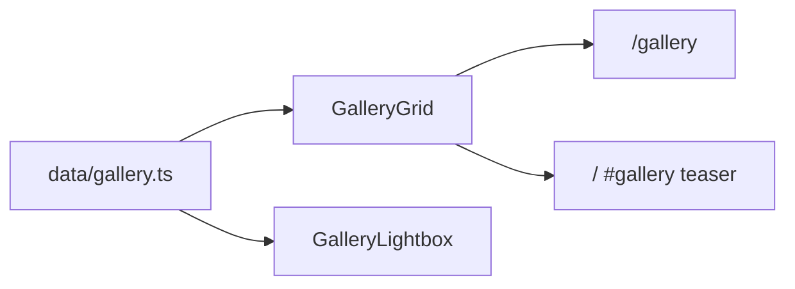

# Content refresh and UI cleanup — pre-execution brief

This document outlines planned work **before** implementation. It is the single reference for scope, file touchpoints, and sequencing. **No implementation steps have been executed as part of creating this file.**

---

## Context (current codebase)

- **Gallery location:** Single canonical gallery at `/gallery` with category tabs. Data lives in [`data/gallery.ts`](data/gallery.ts); UI in [`components/Gallery.tsx`](components/Gallery.tsx). The homepage includes an **Our Work** teaser (`Gallery` with `variant="teaser"`) that shows only the first `GALLERY_TEASER_COUNT` items—see [`GALLERY PLAN.md`](GALLERY%20PLAN.md).
- **Section names vs. UI labels:** The site uses filter labels **All**, **Residential**, and **Driveways & Patios** (not a separate tab literally named “Driveway Cleaning”). Driveway-related work is grouped under **Driveways & Patios**. The residential services hub is [`/services/residential`](app/services/residential/page.tsx).
- **Tags / chips:** Each gallery item uses `category` for filtering and `tagPlaceholder` for the yellow chip text on tiles and in the lightbox (when enabled).
- **Empty tiles:** Any `GalleryItem` without `thumbSrc` or `imageSrc` renders the dark gradient placeholder with a large id number in [`components/Gallery.tsx`](components/Gallery.tsx). In [`data/gallery.ts`](data/gallery.ts), items **id 9–18** currently have no image paths.
- **Equipment tag:** The **Equipment** gallery filter and items **id 17–18** are defined only in [`data/gallery.ts`](data/gallery.ts) (see Section 3).
- **Reference files not in repo:** `image_dd791c.jpg` was not found in the repository; add under `public/` when available if it should be used.
- **“Industrial service image”:** The codebase does not contain that exact string. Closest placeholder copy is in [`components/Services.tsx`](components/Services.tsx) (`imageLabel`: “Residential service image” / “Commercial service image”), shown only when `imageSrc` is missing. The **primary visual match** for the numbered gradient grid (e.g. “Driveway Revival,” “Patio Cleaning,” blocks 9–16) is the **gallery** data plus [`components/Gallery.tsx`](components/Gallery.tsx) placeholder rendering.
- **Staging user-provided images:** Assets may live under the Cursor workspace `assets/` folder with generated names. **When implementing:** copy optimized files into [`public/gallery/`](public/gallery/) and reference stable paths in [`data/gallery.ts`](data/gallery.ts).

---

## 1. Image integration and organization

### Locate the relevant “sections”

| User concept | Where it exists in the app |
|--------------|----------------------------|
| **All** | `/gallery` with the **All** tab (no `category` query param), or `?category=all` |
| **Residential** | `/gallery?category=residential` |
| **Driveway cleaning** | `/gallery?category=driveways` (label: **Driveways & Patios**) |

There are no separate standalone pages named “Driveway Cleaning” or “All” beyond the gallery route and its query-driven filters.

### Add the newly provided images

- Place final assets under [`public/gallery/`](public/gallery/) (e.g. `gallery-20.png`, or a consistent naming scheme).
- Add or update rows in [`data/gallery.ts`](data/gallery.ts) with `imageSrc`, `thumbSrc` (may match `imageSrc`), `alt`, `category`, and `tagPlaceholder`.

### Apply tags per existing site logic

- **`category`** — drives which filter tab includes the item (and “All” includes every item).
- **`tagPlaceholder`** — drives the yellow chip text; align with existing patterns, e.g. `"Residential"`, `"Driveways & Patios"`.

### Suggested mapping (confirm during implementation)

| Asset (user-provided) | `category` | `tagPlaceholder` |
|----------------------|------------|-------------------|
| Driveway with surface cleaner / active job | `driveways` | `Driveways & Patios` |
| Stained / worn driveway (“before” style) | `driveways` | `Driveways & Patios` |
| Suburban home / street scene (empty-block reference) | `residential` | `Residential` |

**Requirement:** The **third** image (suburban residential scene identified as the empty-block reference) must be assigned to **`category: "residential"`** with **`tagPlaceholder: "Residential"`** so it appears under **Residential** and **All**.

---

## 2. UI cleanup — empty block removal

### What counts as an “empty block” here

- **Gallery:** `GalleryItem` entries with no `thumbSrc`/`imageSrc` → gradient tile with large id in [`components/Gallery.tsx`](components/Gallery.tsx).
- **Optional:** The fallback branch in [`components/Services.tsx`](components/Services.tsx) when `imageSrc` is absent (icon + `imageLabel` text).

### Primary example (matches the numbered placeholder grid)

- **[`data/gallery.ts`](data/gallery.ts)** — items **9–16** (e.g. “Driveway Revival,” “Patio Cleaning,” “Community Pool Deck,” “Common Area,” “Brick Wall Cleaning,” “Stone Pathway,” “Dramatic Transformation,” “Deck Restoration”) **without** image fields.
- **Additional:** items **17–18** (equipment-themed placeholders) — coordinated with Section 3.

### Cleanup approach

For each imageless row: **either** supply real images and metadata **or** **remove** the item from `galleryItems` so only real photography remains.

### Layout after removal

[`GalleryGrid`](components/Gallery.tsx) uses a responsive CSS grid (`grid-cols-2` / `md:grid-cols-3` / `lg:grid-cols-4`). **Removing items does not require layout code changes**—remaining tiles reflow. If a category has zero items, the full gallery already shows a “No gallery items in this category yet.” message.

### Files / components to record when auditing

| File | Relevance |
|------|-----------|
| [`data/gallery.ts`](data/gallery.ts) | Defines which tiles are empty vs. filled |
| [`components/Gallery.tsx`](components/Gallery.tsx) | Renders placeholders when images are missing |
| [`components/Services.tsx`](components/Services.tsx) | Fallback copy for missing service card images |
| [`components/ServiceCategoryHubTemplate.tsx`](components/ServiceCategoryHubTemplate.tsx) | Mentions “placeholder” in copy (hub pages, not gallery tiles) |

**Reference:** User-mentioned **`image_dd791c.jpg`** — wire in [`data/gallery.ts`](data/gallery.ts) after it exists under `public/` if it is part of the refresh.

---

## 3. Tag management — remove the “Equipment” gallery tag

**Scope:** Remove the **Equipment** **gallery filter** and related gallery metadata—not every occurrence of the English word “equipment” in marketing copy (e.g. “professional equipment” on other pages).

### Planned edits (when implementing)

- **[`data/gallery.ts`](data/gallery.ts):**
  - Remove `"equipment"` from `GalleryFilterId`.
  - Remove the Equipment row from `galleryCategories`.
  - Remove `equipment` from `galleryCtaByCategory`.
  - Remove or reassign gallery items with `category: "equipment"` (ids **17–18**).
- **[`components/Gallery.tsx`](components/Gallery.tsx):** Adjust only if TypeScript types or imports require it after `data/gallery.ts` changes.

Invalid `?category=equipment` URLs should fall back to safe behavior (existing logic resets unknown categories toward **All**).

---

## 4. AI image generation (HOA and Community) — review only

**Goal:** Realistic, high-quality images representing **Georgia HOA and community** cleaning contexts—authentic suburban Georgia neighborhoods (architecture, greenery, lighting).

**Critical constraint:** **Do not** add these files to the site or [`data/gallery.ts`](data/gallery.ts) until **after** stakeholder review and approval.

**When implementing this step:**

1. Generate a small set of candidates (e.g. 2–4 images) with prompts emphasizing Metro Atlanta / Georgia suburbs, HOA common areas, pool decks, sidewalks, community buildings, natural daylight.
2. **Deliver previews in chat** (or an agreed shared location) for approval.
3. **After approval:** optimize assets, place under [`public/gallery/`](public/gallery/), and add `galleryItems` with `category: "hoa"` and `tagPlaceholder` consistent with the **HOA & Community** label.

---

## 5. Implementation checklist (files to modify later)

Use this as the execution checklist **after** this document is approved.

### Will likely change

- [ ] [`data/gallery.ts`](data/gallery.ts) — new images, `tagPlaceholder`/`category`, remove equipment filter and items, remove or backfill empty rows.
- [ ] [`public/gallery/`](public/gallery/) — new image files (and any renamed user assets).
- [ ] [`components/Services.tsx`](components/Services.tsx) — **only if** the residential (or commercial) hero image should be swapped to a new asset.

### Verify; change only if needed

- [ ] [`components/Gallery.tsx`](components/Gallery.tsx) — placeholder branches remain unless all imageless items are removed.
- [ ] [`app/gallery/page.tsx`](app/gallery/page.tsx), [`app/gallery/layout.tsx`](app/gallery/layout.tsx) — metadata currently does not mention Equipment; update only if copy changes.

### Optional documentation

- [ ] [`GALLERY PLAN.md`](GALLERY%20PLAN.md) — update if teaser count or behavior changes.

---

## Recommended execution order

1. Stage images in `public/gallery/` and update [`data/gallery.ts`](data/gallery.ts) (Section 1).
2. Remove the Equipment filter and equipment-only items (Section 3).
3. Backfill or delete remaining empty gallery rows (Section 2).
4. Generate HOA/community AI images; obtain approval; then add (Section 4).
5. QA: `/`, `/gallery`, `/gallery?category=residential`, `/gallery?category=driveways`, and legacy `?category=equipment` behavior.

---

## Gallery data flow (reference)

---

*Document version: created as planning artifact only; no gallery, tag, or asset implementation included.*
