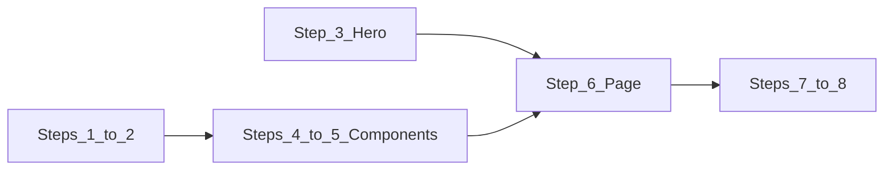

# Implementation plan: visual and CRO homepage update

**Spec reference:** [COPY_PLAN.md](./COPY_PLAN.md) — authoritative step-by-step instructions and copy/paste snippets.

**Last verified (optional):** _Edit this date when you refresh the repo snapshot table._

---

## Document purpose

- **Single source for execution:** Steps align with [COPY_PLAN.md](./COPY_PLAN.md); use that file for exact code blocks.
- **Scope — “visuals” update:** Layout/structure (hero CTAs, homepage section order), trust UI (`TrustBadges`, `StatsBar`), animation/visibility fixes, design tokens for service-areas styling, and visible testimonial/FAQ UI (cards, headers, `source` line)—plus copy where it ships in those components.
- **Progress tracking:** Use the master checklist below (`[ ]` / `[x]`) across chats; keep this file updated as items complete.

---

## Repo snapshot (baseline — update when starting work)

Record findings so the next dev does not re-discover the same state.

| Area | Expected state (from COPY_PLAN) | Current snapshot |
|------|--------------------------------|------------------|
| `components/TrustBadges.tsx` | Exists; no `style={{ opacity: 0 }}` on animated items | **Missing** — recreate per COPY_PLAN Steps 1 & 4 |
| `components/StatsBar.tsx` | New file from Step 5 | **Missing** — create per Step 5 |
| `app/page.tsx` | `TrustBadges` + `StatsBar` + CRO section order (Step 6) | **Not done** — no TrustBadges/StatsBar; order not yet CRO layout |
| `components/Hero.tsx` | Secondary “Get a Free Quote” CTA (Step 3) | **Likely complete** — secondary CTA present |
| `app/globals.css` | `navy` / `brand` Tailwind aliases (Step 2) | **Likely complete** — aliases in `@theme inline` |
| `components/Services.tsx` | No inline `opacity: 0` on primary service card | **Likely complete** — no offending inline style on primary card |

Re-verify each row before closing the milestone; git history may change.

---

## Dependency flow

Order: foundation (Steps 1–2) → hero CTA (3) → new components (4–5) → homepage composition (6) → testimonial/FAQ polish (7–8).

---

## Master checklist

Check items off as you complete them.

### Foundation

- [ ] **Step 1 — `components/Services.tsx`:** Confirm primary service cards have no inline `style={{ opacity: 0 }}` conflicting with animations (see COPY_PLAN Step 1).
- [ ] **Step 1 — `components/TrustBadges.tsx`:** Restore/create component; remove any inline `opacity: 0` on badge rows per COPY_PLAN.
- [ ] **Step 2 — `app/globals.css`:** Confirm `@theme inline` includes `navy`, `navy-light`, `brand`, `brand-light` aliases used by `app/service-areas/page.tsx`.

### Hero and homepage structure

- [ ] **Step 3 — `components/Hero.tsx`:** Secondary “Get a Free Quote” button wired to `onOpenQuoteForm` (verify against COPY_PLAN if design drifts).
- [ ] **Step 4 — `app/page.tsx`:** Import and render `<TrustBadges />` between `<Hero />` and `<Services />`.
- [ ] **Step 5 — `components/StatsBar.tsx`:** Add new component exactly as COPY_PLAN Step 5 (icons, tokens, `aria-label`).
- [ ] **Step 6 — `app/page.tsx`:** CRO order: Hero → TrustBadges → StatsBar → Services → BeforeAfter → WhyChooseUs → Gallery → Testimonials → Offers → FAQ → ContactSection (match COPY_PLAN).

### Testimonials and FAQ (visible UI + copy)

- [ ] **Step 7 — `components/Testimonials.tsx`:** Add `source` field, replace testimonial data, update header subcopy (5.0 / 32+ reviews), render `source` on desktop and mobile cards.
- [ ] **Step 8 — `components/FAQ.tsx`:** Replace placeholder answers in `faqs` array with COPY_PLAN copy.

### Verification

- [ ] Run `npm run build` (or the project’s lint/build script) with no errors.
- [ ] Visual pass: homepage fold shows trust band + stats after hero; no invisible cards; service-areas page classes resolve (no “missing color” look).
- [ ] Quick accessibility pass: `StatsBar` section label; interactive CTAs keyboard-focusable.

---

## Handoff for other AI chats

- Read [COPY_PLAN.md](./COPY_PLAN.md) for exact snippets; use **this file** for order and checkboxes.
- Update the **repo snapshot** table when major files change.
- Mark checklist items `[x]` only when work is merged or explicitly verified end-to-end.
