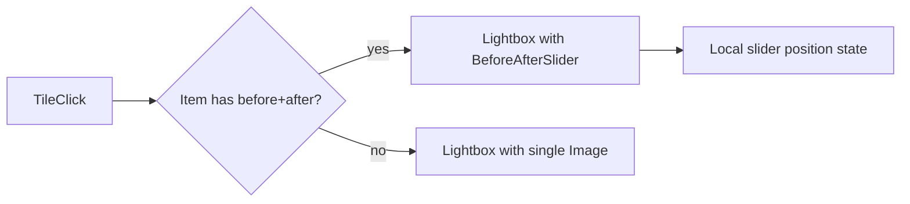

# Before / After gallery - implementation reference

## 1. Context (from codebase)

- **Gallery route**: [`app/gallery/page.tsx`](app/gallery/page.tsx) renders [`Gallery`](components/Gallery.tsx) with `variant="full"`. Category comes from `?category=` via `useSearchParams`; [`isValidGalleryCategoryParam`](data/gallery.ts) includes `before-after`, so **`/gallery?category=before-after`** is the correct URL.
- **Current behavior**: [`GalleryFull`](components/Gallery.tsx) filters [`galleryItems`](data/gallery.ts) by `activeCategory`. Tile clicks call `openLightbox(index)`; [`GalleryLightbox`](components/Gallery.tsx) shows a single [`next/image`](https://nextjs.org/docs/app/api-reference/components/image) with `object-contain` in a fixed portal overlay, or **`BeforeAfterSlider`** when the item defines `beforeSrc` and `afterSrc`.
- **Reference slider (homepage)**: [`BeforeAfter.tsx`](components/BeforeAfter.tsx) wraps the shared [`BeforeAfterSlider`](components/BeforeAfterSlider.tsx) and derives its comparison list from **`galleryItems`** (`before-after` + `beforeSrc`/`afterSrc`), keeping marketing copy aligned with the full gallery.

This matches the stack: Next.js App Router, client components, Tailwind, `next/image`, Lucide icons, portal overlay for the lightbox.

---

## 2. Architecture

### Component structure

| Piece | Responsibility |
|--------|----------------|
| **`BeforeAfterSlider`** | Presentational slider: props for URLs, alts, optional `object-position`, aspect, `sizes`. Internal state `sliderPosition` 0–100; After layer + clipped Before + range + handle + badges. |
| **`GalleryLightbox`** | Branches: if `beforeSrc && afterSrc`, render `BeforeAfterSlider` in the main stage; else single `Image` `object-contain`. Portal, Escape, body scroll lock unchanged. |
| **Data** | [`GalleryItem`](data/gallery.ts) optional `beforeSrc`, `afterSrc`, `beforeAlt`, `afterAlt`, `beforeObjectPosition`, `afterObjectPosition`, optional `comparisonAspect`. |

### State management

- **Slider position**: Local to `BeforeAfterSlider`; reset by **`key={item.id}`** (and index) when the lightbox item changes.
- **Lightbox**: Single `lightboxIndex`; mode derived from the active item’s fields (no separate mode state).

---

## 3. Alignment strategy (varying aspect ratios)

**Principle**: Both layers share one **identical** layout box and the **same** `object-fit` and **synchronized** `object-position` (per pair).

1. **Outer container**: Default **`aspect-[4/3]`**; optional per-item **`comparisonAspect`** (Tailwind arbitrary class string) in data when a pair needs a different frame.
2. **`object-cover`** on both layers; tune alignment with **`beforeObjectPosition` / `afterObjectPosition`**.
3. **Letterboxing**: If needed later, use **`object-contain`** on **both** layers for specific pairs.
4. **`sizes`**: Passed through for responsive `next/image` selection.
5. **Resize**: Both layers are `absolute inset-0` in one `relative` box-layout stays locked.

---

## 4. Gallery integration

1. **Schema** ([`data/gallery.ts`](data/gallery.ts)): Optional comparison fields on `GalleryItem`. For `category: "before-after"`, entries should include **`beforeSrc` and `afterSrc`** (and alts) when using the interactive viewer. **`thumbSrc` / `imageSrc`**: typically the “after” (or a composite) for the grid tile.
2. **Click path**: `onOpen(index)` unchanged; lightbox inspects the item and picks the branch.
3. **Prev/Next**: Navigating items remounts the slider via **`key`** so position resets to default behavior inside `BeforeAfterSlider` (initial animation / 50% per reduced-motion rules).
4. **Activator focus**: [`GalleryGrid`](components/Gallery.tsx) passes the tile element into `openLightbox` so **focus returns** to the tile on close.

---

## 5. Enhancements (slider + lightbox)

1. **Pointer drag** on the comparison track (`setPointerCapture`) alongside the invisible `range` input.
2. **`prefers-reduced-motion`**: Skips intro animation; starts at 50%.
3. **Intro animation**: After both images load, animates position **0 → 50** (when motion is allowed).
4. **Keyboard**: `ArrowLeft` / `ArrowRight` on the range adjust by steps (~3%).
5. **Focus return**: Last-focused tile restored when exiting the viewer.
6. **Loading**: Pair fades in when **both** `Image` components fire `onLoadingComplete`.
7. **Focus-visible**: Range and interactive controls use visible focus rings.

---

## 6. Asset layout

Production before/after pairs live under **`public/gallery/before-after/`** as numbered files: **`01-before.png` / `01-after.png`** through **`12-before.png` / `12-after.png`**. Paths are referenced in [`data/gallery.ts`](data/gallery.ts) (`category: "before-after"`, ids **11–22**). The homepage [`BeforeAfter.tsx`](components/BeforeAfter.tsx) section builds its carousel from the same `galleryItems` rows.

---

## 7. Implementation order (completed)

1. **`BeforeAfterSlider`** extracted; **`BeforeAfter.tsx`** uses it.
2. **`GalleryItem`** extended; **`before-after`** items in `galleryItems`.
3. **`GalleryLightbox`** branching + activator focus + slider **`key`**.
4. Polish: pointer drag, reduced motion, load fade, keyboard nudge, focus return.
