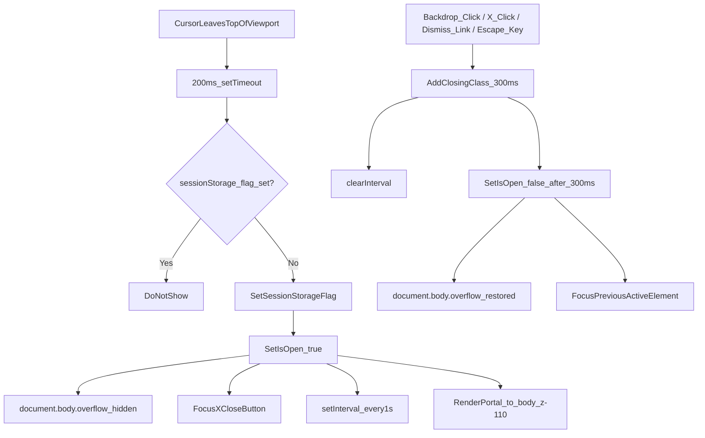

# IMPLEMENTATION_OFFER.md

## Scope Guardrails

- Change only these files:
  - `data/offers.ts` - offer card terms/fine print copy
  - `components/sections/Offers.tsx` - section-level disclaimer line only if needed for consistency
  - `components/layout/ExitIntentPopup.tsx` - new self-contained popup component (created fresh)
  - `components/providers/AppProviders.tsx` - single import/render of `ExitIntentPopup`
- Keep all existing layouts, card structures, and styles intact outside these targeted areas.
- No third-party popup libraries.

---

## Change 1: Special Offers Pricing Accuracy

### Target files
- `data/offers.ts` - update `standardTerms` and each card's `terms` string
- `components/sections/Offers.tsx` - update the section footer disclaimer if dollar figure changes

### Actual service prices (source: pressurewashingxpert.com/services)

| Service | Price |
|---|---|
| Home exterior wash (up to 2,000 sq ft) | $230 |
| Home exterior wash (up to 3,500 sq ft) | $320 |
| Soft washing (up to 1,000 sq ft / one side) | $199 |
| Driveway power washing (up to 100 sq ft) | $235 |
| Carpet cleaning (3 rooms) | $150 |
| Business phone | 1-800-451-7213 |

### Current state (offers.ts)

```
const standardTerms =
  "Cannot be combined with other offers. $250 minimum job total required for discount to apply."
```

The `$250` minimum is not grounded in any listed service price. The cheapest listed service is carpet cleaning at $150; the most likely single-service minimum that maps cleanly to real pricing is the house wash at $230.

### Changes to make

**`standardTerms`** - replace the stale `$250` minimum:
```
Cannot be combined with other offers. Minimum job total applies; ask us to confirm based on your service selection.
```

Or if a numeric minimum is preferred, anchor to the lowest real single-service that qualifies for a discount (house wash at $230):
```
Cannot be combined with other offers. $230 minimum job total required for discount to apply.
```

**Card 1 - `first-time` (15% OFF - New Customer Welcome)**
- Terms currently: `"New customers only, first completed job. ${standardTerms}"`
- Updated terms should note example savings against real prices so customers can calibrate:
```
New customers only, first completed job. Example: 15% off a $230 house wash saves you $34.50. Cannot be combined with other offers. Minimum job total applies.
```

**Card 2 - `bundle` (20% OFF - Curb Appeal Bundle)**
- Terms currently: `"At least two qualifying services on one scheduled visit. ${standardTerms}"`
- Bundle example using real prices (house wash + driveway = $230 + $235 = $465):
```
At least two qualifying services on one scheduled visit. Example: house wash + driveway ($230 + $235 = $465) at 20% off saves you $93. Cannot be combined with other offers. Minimum job total applies.
```

**Card 3 - `seasonal` (10% OFF - Spring & Fall Refresh)**
- Terms currently: `"Valid for jobs scheduled in March–May or September–November. ${standardTerms}"`
- Updated with real example:
```
Valid for jobs scheduled in March–May or September–November. Example: 10% off a $230 house wash saves you $23. Cannot be combined with other offers. Minimum job total applies.
```

**Card 4 - `referral` ($50 EACH - Refer a Neighbor)**
- Terms currently: `"Referral must mention you and complete a paid service. Credits apply to your next qualifying job. ${standardTerms}"`
- $50 credit is meaningful context against real prices:
```
Referral must mention you and complete a paid service. $50 credit applies to your next qualifying job (e.g., toward a $230 house wash or $235 driveway clean). Cannot be combined with other offers. Minimum job total applies.
```

**Section footer in `Offers.tsx` (line 121–123)**
- Current: `"Offers cannot be combined. A $250 minimum job total applies before any discount. Referral credits are issued after the referred customer completes a paid service. Contact us for full terms."`
- Updated: replace `$250` with language consistent with updated cards:
```
Offers cannot be combined. Minimum job total applies before any discount. Referral credits are issued after the referred customer completes a paid service. Call 1-800-451-7213 for full terms.
```

---

## Change 2: Exit-Intent Popup

### New file to create
`components/layout/ExitIntentPopup.tsx`

### Mount point (single line change)
`components/providers/AppProviders.tsx` - import and render `<ExitIntentPopup />` alongside `{children}` inside `TooltipProvider`.

---

### Architecture diagram



---

### Trigger logic

```ts
// components/layout/ExitIntentPopup.tsx (pseudo)

const SESSION_KEY = "exitPopupShown"

useEffect(() => {
  const handleMouseLeave = (e: MouseEvent) => {
    if (e.clientY > 20) return           // only fire at top edge
    if (sessionStorage.getItem(SESSION_KEY)) return
    setTimeout(() => {
      sessionStorage.setItem(SESSION_KEY, "1")
      setIsOpen(true)
    }, 200)
  }
  document.addEventListener("mouseleave", handleMouseLeave)
  return () => document.removeEventListener("mouseleave", handleMouseLeave)
}, [])
```

---

### Animation classes (Tailwind inline styles - no new CSS files)

| Element | Open | Close |
|---|---|---|
| Backdrop | `opacity-0 -> opacity-60`, `300ms` | reverse `300ms` |
| Modal card | `translateY(-40px) + opacity-0 -> translateY(0) + opacity-100`, `400ms ease-out` | reverse `300ms` |
| CTA button | `@keyframes pulse-cta` - scale 1 → 1.04 → 1 every 1.8s | N/A |

Animations use inline `style` + `transition` / `animation` properties (same pattern as `BeforeAfterSlider.tsx`) to avoid requiring Tailwind config changes.

---

### Popup structure

```
[Portal → document.body]
  [Backdrop - fixed inset-0 z-[110] bg-black/60]
    [Modal - bg-#1a2744, rounded-xl, max-w-lg, shadow-2xl]

      ── Section A: Scarcity Banner ──
      "🔴 April Slots Filling Fast - Only 3 Spots Left This Month!"
      [10 slot blocks: 7 × red #e53e3e | 3 × green #38a169]
      "7 of 10 April spots claimed"

      ── Section B: Offer Block ──
      [H2] "Wait - Don't Miss This April Special!"
      [Sub] "Spring is peak season. Lock in your rate before May pricing kicks in."
      [Gold text]
        🏠 House Wash + Driveway Bundle
        Regular: $230 + $235 = $465
        April Exclusive: $380 (you save $85)
      [Countdown] "⏳ Expires in: 2d 14h 33m 12s" - updates every second

      ── Section C: CTA ──
      [Button - gold, full-width, pulsing]
        "📞 Claim Your Spot - Call 1-800-451-7213"
        href: tel:18004517213
      [Fine print - muted gray, small]
        "Cannot be combined with other offers.
         Minimum job total applies. Call to confirm availability."
      [Dismiss link - very small, low contrast gray]
        "No thanks, I'll take my chances in May →"

      [X button - top-right, small, low contrast, aria-label="Close offer"]
```

---

### Countdown timer logic

```ts
const TARGET = new Date("2026-04-30T23:59:00")   // April 30, 11:59 PM

useEffect(() => {
  if (!isOpen) return
  const tick = () => {
    const diff = TARGET.getTime() - Date.now()
    if (diff <= 0) { setTimeLeft("Expired"); return }
    const d = Math.floor(diff / 86_400_000)
    const h = Math.floor((diff % 86_400_000) / 3_600_000)
    const m = Math.floor((diff % 3_600_000) / 60_000)
    const s = Math.floor((diff % 60_000) / 1_000)
    setTimeLeft(`${d}d ${h}h ${m}m ${s}s`)
  }
  tick()
  const id = setInterval(tick, 1_000)
  return () => clearInterval(id)
}, [isOpen])
```

---

### Focus trap (same pattern as Gallery.tsx)

```ts
const handleKeyDown = (e: React.KeyboardEvent<HTMLDivElement>) => {
  if (e.key === "Escape") { close(); return }
  if (e.key !== "Tab" || !modalRef.current) return
  const focusables = modalRef.current.querySelectorAll<HTMLElement>(
    'button:not([disabled]), a[href], [tabindex]:not([tabindex="-1"])'
  )
  const list = Array.from(focusables)
  if (list.length === 0) return
  const first = list[0]; const last = list[list.length - 1]
  if (!e.shiftKey && document.activeElement === last) {
    e.preventDefault(); first.focus()
  } else if (e.shiftKey && document.activeElement === first) {
    e.preventDefault(); last.focus()
  }
}
```

---

### Design tokens (match existing site)

| Token | Value |
|---|---|
| Modal background | `#1a2744` |
| Gold accent | `#f0a500` |
| Filled slot (red) | `#e53e3e` |
| Available slot (green) | `#38a169` |
| Body text | `#ffffff` |
| Fine print | `rgba(255,255,255,0.45)` |
| Border radius (modal) | `12px` |
| Box shadow | `0 25px 60px rgba(0,0,0,0.6)` |
| Z-index | `110` (above header z-50, above lightbox z-100) |

---

### Accessibility checklist

- `role="dialog"` and `aria-modal="true"` on modal div
- `aria-label="Close offer"` on X button
- Focus moves to X button on open
- Focus restores to previously focused element on close
- `Escape` closes modal
- Tab cycles within modal (focus trap)
- `document.body.overflow = "hidden"` while open, restored on close

---

### Mobile responsiveness

| Breakpoint | Behavior |
|---|---|
| < 640px | Full-width modal, `margin: 0 16px`, headline `22px`, slot blocks scale down but stay in single row |
| ≥ 640px | Max-width `lg` (512px), centered, headline `28px` |

---

### AppProviders.tsx change (minimal)

```tsx
// Before
export function AppProviders({ children }: { children: ReactNode }) {
  return <TooltipProvider>{children}</TooltipProvider>
}

// After
import { ExitIntentPopup } from "@/components/layout/ExitIntentPopup"

export function AppProviders({ children }: { children: ReactNode }) {
  return (
    <TooltipProvider>
      {children}
      <ExitIntentPopup />
    </TooltipProvider>
  )
}
```

---

## Verification Checklist

- [ ] Only these files are modified/created: `data/offers.ts`, `components/sections/Offers.tsx`, `components/layout/ExitIntentPopup.tsx`, `components/providers/AppProviders.tsx`
- [ ] Offer cards render with same layout, discount labels, icons, and button styles - only `terms` text changed
- [ ] Section disclaimer matches updated terms language
- [ ] Exit-intent popup fires on top-edge mouse leave only
- [ ] 200ms delay before opening
- [ ] `sessionStorage` prevents repeat shows within same browser session
- [ ] All close paths work (X, backdrop, dismiss link, Escape)
- [ ] Open/close animations complete cleanly (no flash/jump)
- [ ] Countdown updates every second and displays time remaining to April 30 11:59 PM
- [ ] Slot tracker shows 7 red + 3 green blocks in one row on all screen sizes
- [ ] CTA pulse animation runs continuously while modal is open
- [ ] Focus trap contains keyboard navigation inside modal
- [ ] Restore focus to previously active element on close
- [ ] `document.body.overflow` restored after close
- [ ] Mobile layout: full-width, 16px padding, 22px headline, slot row intact
- [ ] `npm run build` passes with no TypeScript or lint errors
