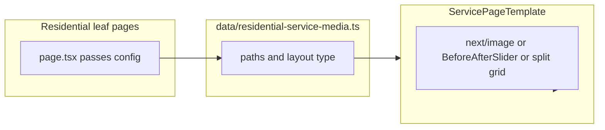

# UPDATING_IMPROVEMENTS

Implementation specification for residential service page imagery, template wiring, and removal of the Landscape Features route. Use this document as the single source of truth when implementing.

---

## Goal

1. Add real photos to **Residential** leaf service pages by replacing the **“Service Image Placeholder”** block in [`components/templates/ServicePageTemplate.tsx`](../../components/templates/ServicePageTemplate.tsx) (benefits section, ~lines 96–101).
2. Use the **11 images** supplied for this project; copy them into **`public/residential-services/`** with **stable, readable names** so `next/image` paths are clean and cacheable.
3. **Remove Landscape Features** from the site: navbar, hub, generators, and **delete** [`app/services/residential/landscape-features/`](../../app/services/residential/landscape-features/).
4. **Roof Soft Washing:** **no image work** in this milestone—leave the placeholder until a future pass.

---

## Source assets (numbered 1–11)

Copy originals (see [Original filenames](#original-filenames-cursor-assets)) into `public/residential-services/`:

| # | Public filename | Page / use |
|---|-----------------|------------|
| 1 | `house-washing-01.png` | House Washing — single benefits-column image |
| 2 | `decks-fences-01.png` | Decks and Fences — split (first panel) |
| 3 | `decks-fences-02.png` | Decks and Fences — split (second panel) |
| 4 | `driveways-sidewalks-01.png` | Driveways and Sidewalks — split |
| 5 | `driveways-sidewalks-02.png` | Driveways and Sidewalks — split |
| 6 | `masonry-before.png` | Brick, Stone & Masonry — before |
| 7 | `masonry-after.png` | Brick, Stone & Masonry — after |
| 8 | `gutters-before.png` | Gutter Cleaning — before |
| 9 | `gutters-after.png` | Gutter Cleaning — after |
| 10 | `curbing-before.png` | Curbing Cleaning — before |
| 11 | `curbing-after.png` | Curbing Cleaning — after |

**Note:** One curbing asset may need **EXIF/CSS rotation** after visual QA (sideways source photo). Fix during implementation if the crop looks wrong.

### Original filenames (Cursor assets)

If files were saved by Cursor under the workspace `assets/` folder (or `.cursor/projects/.../assets/`), they correspond to rows 1–11 in order:

1. `c__Users_darie_AppData_Roaming_Cursor_User_workspaceStorage_06423a2ccc90eab05eb510ad32b15c93_images_After8__1_-fc176df8-1935-4662-a149-e8a90aae2aa4.png`
2. `c__Users_darie_AppData_Roaming_Cursor_User_workspaceStorage_06423a2ccc90eab05eb510ad32b15c93_images_image-ba9cf4c7-fa3b-4872-94f2-3696934bf303.png`
3. `c__Users_darie_AppData_Roaming_Cursor_User_workspaceStorage_06423a2ccc90eab05eb510ad32b15c93_images_image-b0aa0c6e-7165-4a67-a81f-5444d2ac0b19.png`
4. `c__Users_darie_AppData_Roaming_Cursor_User_workspaceStorage_06423a2ccc90eab05eb510ad32b15c93_images_image-b6d2d882-f843-4f44-a46c-1f8dc5ffa177.png`
5. `c__Users_darie_AppData_Roaming_Cursor_User_workspaceStorage_06423a2ccc90eab05eb510ad32b15c93_images_image-1af31c3f-ba22-44d5-b9ee-04c1a0c336f8.png`
6. `c__Users_darie_AppData_Roaming_Cursor_User_workspaceStorage_06423a2ccc90eab05eb510ad32b15c93_images_Before2__1_-da889266-c8f8-4ebb-bfe4-577c0f72963e.png`
7. `c__Users_darie_AppData_Roaming_Cursor_User_workspaceStorage_06423a2ccc90eab05eb510ad32b15c93_images_after2__1_-0968ac57-20e4-4310-989f-1b9a7f639d61.png`
8. `c__Users_darie_AppData_Roaming_Cursor_User_workspaceStorage_06423a2ccc90eab05eb510ad32b15c93_images_image-ef283023-d547-41b2-b1fb-c3e91e25aeba.png`
9. `c__Users_darie_AppData_Roaming_Cursor_User_workspaceStorage_06423a2ccc90eab05eb510ad32b15c93_images_image-7910cc78-0f2e-4ada-b0d8-be072f016e16.png`
10. `c__Users_darie_AppData_Roaming_Cursor_User_workspaceStorage_06423a2ccc90eab05eb510ad32b15c93_images_Before12__1_-e6eda478-3d30-471b-b858-69e04dbd8f61.png`
11. `c__Users_darie_AppData_Roaming_Cursor_User_workspaceStorage_06423a2ccc90eab05eb510ad32b15c93_images_After12__2_-1636ae19-d528-4e96-b43d-67e74a6075fc.png`

---

## Per-route media behavior

| Route | Images | UI approach |
|-------|--------|-------------|
| `/services/residential/house-washing` | **1** | Single `next/image` (replace placeholder). |
| `/services/residential/decks-fences` | **2 + 3** | Two-image split: **2-column grid** on `md+`, stack on mobile; or [`BeforeAfterSlider`](../../components/sections/BeforeAfterSlider.tsx) if the pair reads as before/after—choose in implementation from visual fit. |
| `/services/residential/driveways-sidewalks` | **4 + 5** | Same as decks: **split** (grid or slider). |
| `/services/residential/roof-soft-washing` | — | **Skip** — keep placeholder. |
| `/services/residential/brick-stone-masonry` | **6 + 7** | **BeforeAfterSlider** with clear alt text. |
| `/services/residential/gutters` | **8 + 9** | **BeforeAfterSlider**. |
| `/services/residential/curbing` | **10 + 11** | **BeforeAfterSlider** or two-column split; prefer slider when it reads as before/after. |

**Accessibility:** descriptive `alt` strings per image; `comparisonLabel` on sliders.

---

## Template and data layer

1. **Extend `ServicePageTemplate`** with optional props, keeping **backward compatibility** for commercial pages and roof (no props → placeholder remains):
   - Single image: `imageSrc`, `imageAlt`, optional `imageClassName` / `imageObjectPosition`.
   - Optional **before/after**: `beforeSrc`, `afterSrc`, `beforeAlt`, `afterAlt`, `comparisonLabel` → render `BeforeAfterSlider`.
   - Optional **two static images** (no slider): `splitImages: { src, alt }[]` with max length 2, responsive grid.
   - **Do not** change unrelated sections of the template.

2. **Centralize config** in e.g. [`data/residential-service-media.ts`](../../data/residential-service-media.ts), imported by each residential leaf `page.tsx`.

3. **Wire** these pages only: `house-washing`, `decks-fences`, `driveways-sidewalks`, `brick-stone-masonry`, `gutters`, `curbing`. **Do not** pass new media props for `roof-soft-washing`.

---

## Remove Landscape Features completely

| Location | Action |
|----------|--------|
| [`data/navigation.ts`](../../data/navigation.ts) | Remove the `landscape-features` entry from `residentialServices` (the hub at [`app/services/residential/page.tsx`](../../app/services/residential/page.tsx) uses this array). |
| [`app/services/residential/landscape-features/`](../../app/services/residential/landscape-features/) | Delete the route (folder + `page.tsx`). |
| [`scripts/generate-service-pages.js`](../../scripts/generate-service-pages.js) | Remove the Landscape Features entry. |

**Optional:** **301 redirect** from `/services/residential/landscape-features` → `/services/residential` for old inbound links. Otherwise 404 after removal is acceptable.

---

## QA checklist

- [ ] All new `public/residential-services/` paths resolve; no broken images.
- [ ] Residential pages in the table above show real imagery; roof still shows placeholder.
- [ ] No “Landscape Features” in header, footer, or residential hub.
- [ ] Deleted URL behavior acceptable (404 or redirect).
- [ ] `next build` / lint clean; mobile layout for splits and sliders.

---

## Architecture (reference)

---

## Out of scope (this milestone)

- Gallery page / [`data/gallery.ts`](../../data/gallery.ts) repair.
- Commercial service imagery.
- Roof Soft Washing photos.

---

## Implementation task list

- [ ] Copy 11 assets to `public/residential-services/` with stable names; fix rotation if needed.
- [ ] Extend `ServicePageTemplate`: image, `BeforeAfterSlider`, optional two-image split; keep placeholder fallback.
- [ ] Add `data/residential-service-media.ts` and wire six residential pages (skip roof).
- [ ] Remove `landscape-features` from navigation, delete app route, update `generate-service-pages.js`.
- [ ] Visual QA + `npm run build` / lint.
