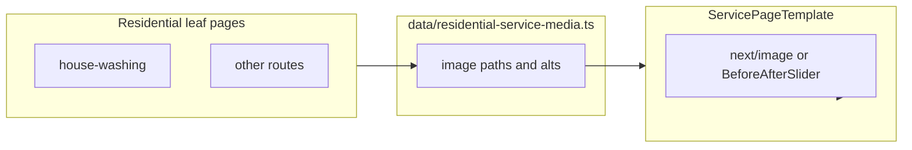

# UPDATING_IMPROVEMENTS — Residential service page imagery

Implementation checklist and technical notes. **No code has been changed as of this document.**

---

## Goal

- Replace the gradient **“Service Image Placeholder”** in the benefits section of every residential **leaf** service page with **real photos already in the repository**.
- **Default approach:** use **after-only** stills (`next/image`) on most pages for simpler layout, performance, and mobile UX.
- **Optional:** use the existing `BeforeAfterSlider` (`components/sections/BeforeAfterSlider.tsx`) on **one** high-traffic page (e.g. house washing) for a stronger before/after story without adding sliders site-wide.

---

## Current state

- Residential leaf pages under `app/services/residential/*/` (house washing, decks, driveways, roof, masonry, gutters, landscape, curbing) render `ServicePageTemplate` (`components/templates/ServicePageTemplate.tsx`), which currently shows a placeholder block in the benefits section (around lines 96–101).
- **On-disk assets** under `public/gallery/`:
  - Before/after pairs: `public/gallery/before-after/` (`01`–`12` before and after).
  - Standalone: `public/gallery/gallery-09.png`, `public/gallery/gallery-10.png`.
- `data/gallery.ts` documents titles and alt text for before/after items; **reuse those alt strings** when the same file is used on a service page.
- **Gap:** `gallery.ts` still references `gallery-01.png`–`gallery-08.png`, but only `gallery-09.png` and `gallery-10.png` exist under `public/gallery/`. This milestone should **only** reference paths that exist. Fixing `/gallery` broken references is a separate follow-up.
- The residential **hub** (`app/services/residential/page.tsx` + `ServiceCategoryHubTemplate`) uses **text** placeholders on cards, not the image placeholder. Optional later: thumbnails or copy updates on hub cards.

---

## Implementation approach

1. **Extend `ServicePageTemplate`** with optional media props:
   - **Single image:** `imageSrc`, `imageAlt`, optional `imageObjectPosition` (same idea as `thumbObjectPosition` in gallery data).
   - **Optional comparison:** when `beforeSrc`, `afterSrc`, `beforeAlt`, `afterAlt`, and a label are provided, render `BeforeAfterSlider` in that column instead of a static image.
   - **Fallback:** if no media props are passed, keep the current placeholder so commercial pages using the same template are unchanged until you opt in.

2. **Centralize mapping** in e.g. `data/residential-service-media.ts`, keyed by route or slug, so each `app/services/residential/*/page.tsx` imports a single config object.

3. **Proposed asset mapping** (verify visually after implementation):

   | Route | Primary image(s) | Notes |
   |-------|------------------|--------|
   | `house-washing` | `/gallery/before-after/01-after.png` (optional: pair with `01-before` for slider) | Aligns with “Vinyl siding — side wall” in gallery |
   | `decks-fences` | `/gallery/before-after/05-after.png` or `12-after.png` | Patio / rear exterior |
   | `driveways-sidewalks` | `/gallery/before-after/03-after.png` or `07-after.png` | Driveway-focused |
   | `roof-soft-washing` | `/gallery/gallery-09.png` | Roofline / gutter view (closest match on disk) |
   | `brick-stone-masonry` | `/gallery/gallery-10.png` or `/gallery/before-after/06-after.png` | Masonry / pavers |
   | `gutters` | `/gallery/gallery-09.png` | Gutter-focused framing in gallery alt |
   | `landscape-features` | `/gallery/before-after/09-after.png` | Retaining wall & walk |
   | `curbing` | `/gallery/before-after/03-after.png` | “Driveway & curb” style result |

4. **Wire** all **eight** residential leaf pages to pass props from the shared map (exclude the residential hub `page.tsx`).

5. **QA:** responsive layout, no harsh layout shift (`fill`, `sizes`), lint/build clean; tweak `object-position` if crops look wrong.

---

## Optional follow-ups (later)

- Residential hub: replace placeholder card copy and/or add per-service thumbnails.
- Repair or remove missing `gallery-01`–`08` references in `data/gallery.ts` so `/gallery` matches assets on disk.
- Apply the same media pattern to **commercial** leaf pages for parity.

---

## Architecture (high level)

---

## Task checklist

- [ ] Add optional image / before-after props to `ServicePageTemplate`; render `next/image` or `BeforeAfterSlider`; keep placeholder fallback.
- [ ] Add `data/residential-service-media.ts` with per-route `src` / `alt` (reuse `gallery.ts` alts where the same asset is used).
- [ ] Pass media props from the map into all eight residential leaf `page.tsx` files.
- [ ] Visual QA (desktop + mobile); run build/lint; adjust `object-position` if needed.
